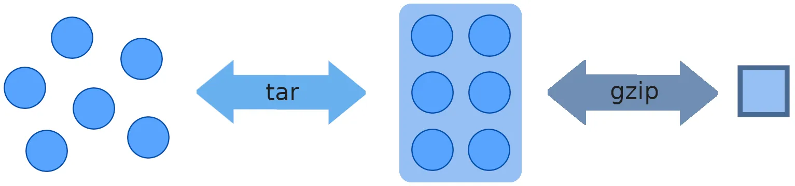

# 3. Basic File Management

Exam obj:

1. Archive, compress, unpack and uncompress files using **tar, star, gzip and bzip2**
2. Create and edit text files (`touch, vim, mkdir`)
3. Create, delete, copy, and move files and directories (`rm, rmdir`)
4. Create hard and soft links

RULE: 

- “`-f`” switch always goes **last** (when working with the `tar` command)
- use `-f` **consistently** when using the `tar` command (to specify tarball you’re referencing)
- Don’t need to use “`.`” to refer to your current directory when using `tar` command

Exam Tip: Manipulating files an directories is one of the most common tasks performed in any OS. Working knowledge of the tools learned in this section is crucial. 

| Description | Command | Switches | Syntax | Function |
| --- | --- | --- | --- | --- |
| Ascertain File Type | `file 
stat  
ls -l` |  |  |  |
| Compression  | `gzip | gunzip` 
`bzip2 | bunzip2` | `-l` = view compression information  or display filename that will be given to the file when it is uncompressed
`-r` = compress an entire directory tree |   |  |
| Archiving (Packaging) | `tar` | `-c` = creates tarball 
`-f` = specifies tarball name
`-p` = Preserve file permissions. Use this if you create an archive as a normal user. 
`-t` = Lists contents of a tarball
`-v` = Verbose mode ( lists detailed version of tarball contents as it is processed)
`-x` = extracts or restores from a tarball
`-r` = Add files to end of an UNCOMPRESSED  EXISTING tarball
`-j` = compress a tarball w/ `bzip2`
`-z` = compress a tarball w/ `gzip`

Note: use `-f` **consistently** when referring to an extant tarball. | `tar -cvf /tmp/home.tar /home`

`tar <switches> <desired location and name of tarball> <directory(-ies) or file(s) you want to archive>`

`tar -cvf /tmp/files.tar /etc/passwd /etc/yum.conf`

`tar -rvf /tmp/files.tar /etc/yum.repos.d`

`tar -xf /tmp/files.tar etc/yum.conf`

`tar -xf /tmp/home.tar.bz -C /tmp`
 | Create a tarball (`tar -c`) in the /tmp directory called home.tar (`-f`) of the /home directory and verbosely list the contents as it’s processed (`-v`)

Create a tarball in the /tmp directory called files.tar of passwd and yum.conf files located in the /etc directory

Append files (`-r`) in the /etc/yum.repos.d directory to the existing tarball - /tmp/files.tar (`-f`)

Restore specific file etc/yum.conf from within the /tmp/files.tar tarball and place it in current directory (`-x`)

Extract (`-x`) files from the bzip2-compressed (`-f`) tarball under /tmp (a different directory than current one) (`-C`) |
| File Editing | `vim
touch
cat` |  |  |  |
| Creating (Files & Directories) | `touch
vim
mkdir`
`cat` | `cat > <filename>` = direct output into newly created file (Ctrl+d to save & return to command prompt) 
`mkdir -p dir/sub1/sub2` =(Parent) Create hierarchy of subdirectories.  |  |  |
| Display File Contents | `cat
head
tail
more
less` | `head -3` = Display first three lines
`tail -f` = (Follow) Allows you to view updates in real time | The `tail -f` command is particularly useful when watching a log file while it is being updated |  |
| Display Word Count | `wc` |  |          78 | 247 | 1899 
# of: lines | words | characters |  |
| Copying (Files & Directories) | `cp` | `-r` = (recursive) copies an entire directory tree to another location
`-p` = Preserve attributes (timestamp, permissions, ownership etc.) of a file or directory | `cp /etc/fstab .` = copies fstab file to current directory
`cp <filename> <newfile>`
`cp <filename> <dirname>` = copy a file into a directory  | Copy the fstab file located in the /etc directory to the directory I’m currently in (”.”) |
| Moving & Renaming (Files & Directories) | `mv` |  |  |  |
| Removing (Files & Directories) | `rm
rmdir` | `-r` = Recursively remove all contents of a directory  |  |  |
| File Linking | `ln` = Hard link creation | `ln -s`= Soft link creation | `ln /tmp/hard1 /tmphard2
ln <full path to source file> <full path to hard link you’re creating>` |  |
| Display inode #  | `ls -i` |  |  |  |

clea

## **(7) File types**

1. regular (-)
2. directory (d)
3. block special device (b)
4. character special device (c)
5. symbolic link (l)
6. ~~named pipe~~
7. ~~socket~~

Commands

- `ls`
- `stat`
- `file`

### **Regular files**

- Text or binary data.
- Represented by hyphen (-).

### **Directory Files**

- Identified by the letter “d” in the beginning of ls output.
- Logical containers (folders that hold files and subdirectories.

### **Block and Character (raw) Special Device Files**

- All hardware has device driver (file) in /dev/.
- Each device driver is used by the kernel to communicate with device.
- Identified by “c” or “b” in `ls -l` listing.
- Each **device driver** is assigned a unique number called the **major number** (which the kernel uses to recognize its type)
- Each **device (or disk partition)** is assigned a **minor number** (to identify it as a unique device)
- Character device
    - reads and writes 8 bits at a time
    - Serial
- Block device
    - Receives data in fixed block size determined by drivers
    - 512 or 4096 bytes

### Major Number

- Used by kernel to recognize device driver type.
- Column 5 of ls listing.

`ls -l /dev/sda`

### Minor Number

- Points to a unique device or partition (that the device driver controls)
- Each device controlled by the same device driver gets a Minor Number
- Applies to disk partitions as well.
- The same driver can control multiple devices of the same type.
- Column 6 of ls listing

`ls -l /dev/sda`

### **Symbolic Links**

- Shortcut to another file or directory.
- Begins with “l” in ls listing.
- Allows you to create a shortcut (link) to an object that exists somewhere else so you don’t have to memorize where the original actually is

`ls -l /usr/sbin/vigr
lrwxrwxrwx. 1 root root 4 Jul 21 14:36 /usr/sbin/vigr -> vipw`

### Inode (index node)

- Data object that contains metadata about the files in your filesystem
- Contains info regarding the files such as: size of file, owner, permission string, etc. (except for name or content itself)
- Every storage medium has its own set of inodes

`[root@server1 ~]# ls -li`

**`17637475** -rw-r--r--.   2 root root   217 Jul 23 21:46 joker`

---

# **Compression and Archiving (Packaging)**

Allows users to conserve disk space or remote copy them at a faster pace. 

Regular files being added to an archive with **`tar`** and then compressed with **`gzip`**.

bzip2 = slower than gzip, better compression (for larger files)

## **Compression**

### **`gzip` (`gunzip`) command or `bzip2` (`bunzip2`)**

- Create a compressed file for each of the specified files.
- Adds .gz extension.
- `gzip` = faster, worse compression ratio (larger target file size)
- `bzip` = slower, better compression ratio (smaller target file size) - better for larger files

### Flags

### Copy a file in /etc directory to the current directory and display filename when uncompressed:

`cp /etc/<filename> .
ls -l <filename>`

### Compress file:

`gzip <filename>`

### Display compression info:

`gzip -l <filename.gz>`

### Uncompress file:

`gunzip <filename.gz>
ls -l <filename>`

### **bzip2 (bunzip2) command**

- Adds .bz2 extension.
- Better compression/ decompression ratio but is slower than gzip.

### Compress fstab using bzip and view details:

`bzip2 <filename>
ls -l <filename.bz2>`

### Unzip fstab.bz2 and view details:

`bunzip2 <filename.bz2>
ls -l <filename>`

## **Archiving**

- Preserves file attributes such as ownership, owning group, and timestamp.
- Can preserve extended file attributes such as ACLs and SELinux contexts (using switches).

### **tar (tape archive) command**

- Create, append, update, list, and extract files/directory tree to/from a file called a tarball (tarfile)
- Can compress a tarball after it’s been created.
- Automatically removes “/” so you do not have to specify the full pathname when restoring files at any location.

### Flags:

tar -c :: Create tarball. 

tar -f :: Specify tarball name. 

tar -p :: Preserve file permissions. Default for the root user. Specify this if you create an archive as a normal user. 

tar -r :: Append files to the end of an existing uncompressed tarball. 

tar -t :: List contents of a tarball. 

tar -u :: Append files to the end of an existing uncompressed tarball provided the specified files being added are newer. -z -j -C

tar -x :: Extracts or restores from tarball.

tar -v :: Verbose mode (provides additional detail in output)

### `tar` Syntax:

***tar -cvf <path to new tarball and its name + extension ‘.tar’ (good housekeeping)> <desired directory/file you are making the tarball of>*** 

### Archive entire home directory:

`tar -cvf /tmp/home.tar /home`

### Archive two specific files:

`tar -cvf /tmp/files.tar /etc/passwd /etc/yum.conf`

### Append files in a directory to existing tarball:

`tar -rvf /tmp/files.tar /etc/yum.repos.d`

### List what is included in home.tar tarball:

`tar -tvf /tmp/files.tar`

### Restore single file and confirm:

`tar -xf /tmp/files.tar etc/yum.conf
ls -l etc/yum.conf`

### Restore all files and confirm:

`tar -xf /tmp/files.tar
ls`

### Create a gzip-compressed tarball under /tmp of /home:

`tar -czf /tmp/home.tar.gz /home`

### Create bzip2-compressed tarball under /tmp of /home:

`sudo tar -cjf /tmp/home.tar.bz2 /home`

### List content of gzip-compressed archive without uncompressing it:

`tar -tf /tmp/home.tar.gz`

### Extract files from gzip-compressed tarball in the current directory:

`tar -xf /tmp/home.tar.gz`

### Extract files from the bzip2-compressed tarball under /tmp (a different location than the current directory):

`tar -xf /tmp/home.tar.bz2 -C /tmp`

---

# **File Editing**

### **Vim**

[vimguide](https://perfectdarkmode.com/linux/3_file_management/vimguide.md)

| **Vim**  |  |  |  |
| --- | --- | --- | --- |
| Function | Mode (to be in) | Command |  |
| Exit | Normal | :q + Enter |  |
| Exit without saving | Normal | :q! + Enter |  |
| Save  | Normal | :w |  |
| Save and exit file | Normal | :wq |  |
| Undo changes | Insert —> Normal | Esc —> u |  |
| Switch into insert mode | Normal | i = Current cursor position
I = Beginning of current line
a = After current cursor position
A = End of current line
o = Opens new line below current line
O = Opens new line above current line |  |
| Navigating within Normal Mode | Normal  | h = Left
j = Down
k = Up 
l = Right
w = Start of next word
b = Start of preceding word
e = Ending character of next word
$ = End of current line
Enter = Beginning of next line
Ctrl+f = Scrolls down to the next page
Ctrl+b = Scrolls up to the previous page
[[ = Move to the first line of the file
]] = Move to the last line of the file
0 = Move to beginning of current line | You can precede any of the commands listed by a number to repeat the command action that many times. |
| Deleting Text | Normal / Command | x = Deletes current character
X = Deletes character before the cursor location
dw = Deletes word or part of the word to the right of the cursor location
dd = Deletes current line
D = Deletes at the cursor position to the end of the current line
:6,12d = Deletes line 6 through 12 | You can precede any of the commands listed by a number to repeat the command action that many times.

Ex: 3dd would remove current line and two lines below it. |
| Reveal Line Numbering  | Command | :set nu = Show
:set nonu = Hide |  |
| Move cursor to beginning of file | Normal | gg |  |
| To copy all text from one file into another | Normal | 1. Open both files at the same time: `vi <filename1> <filename2>`
2. Switch to desired file (to copy from): `:n or :N`
3. Move cursor to the beginning of file: `gg` 
4. Enter visual mode (lets you see the highlight portions): `V`
5. Highlight all the text in the file:  `G`
6. Copy all lines highlighted: `y`
7. Go to other file: `:n or :N`
8. Move cursor to last line of text
9. Paste yanked data below current line: `p` |  |
| Replace text | Normal | :%s/old/new |  |
| Copy Text | Normal | :2,3cp6  | Copy lines 2 through 3 and pastes them **after** 6  |
| Move Text | Normal | :4,6m9 | Moves lines 4 through 6 after line 9 |
| Crtl+Z  |  | Send vim to the background |  |
- You start off in vim (when you open it) in “normal mode”
- Press “i” to enter “insert mode” —where you’ll be able to type
- Press “Esc” to get back to “normal mode”
- Type “ : “ to enter “command mode” from “normal mode”  then “Esc” to go back to “normal mode”

### **File and Directory Operations**

### **`touch` command**

- File is created with 0 bytes in size.
- Run touch on it and it will get a new timestamp

Flags

### Set date on file1 to 2019-09-20:

`touch -d 2019-09-20 file1`

### Change modification time on file1 to current system time:

`touch -m file1`

### **`mkdir` command**

- Create a new directory.

flags

### Create dir1 verbosely:

`mkdir dir1 -v`

### Create dir2/perl/perl5:

`mkdir -vp dir2/perl/perl5`

## **Commands for displaying file contents**

- `cat`
- `more`
- `less`
- `head`
- `tail`

### **cat command**

- Concatenate and print files to standard output.

Flags

### Redirect output to specified file:

`cat > catfile1`

### **tac command**

- Display file contents in reverse

## 

command

- Display files on page-by-page basis.
- Forward text searching only.
- **Ctrl+D** to save content and exit

### Navigation

### **less command**

- Display files on page-by-page basis.
- Forward and backwards searching.

`less /usr/bin/znew`

### Navigation

### **head command**

- Displays first 10 lines of a file.

`head /etc/profile`

### View top 3 lines of a file:

`head -3 /etc/profile`

### **tail command**

- Display last 10 lines of a file.

Flags

`tail /etc/profile`

### View last 3 lines of /etc/profile:

`tail -3 /etc/profile`

### View updates to the system log file /varlog/messages in real time:

`sudo tail -f /var/log/messages`

## **Counting Words, Lines, and Characters in Text Files**

### **`wc` (word count) command**

- Display the number of lines, words, and characters (or bytes) contained in a text file or input supplied.

Flags

 `wc /etc/profile
  85  294 2123 /etc/profile`

### Display count of characters on /etc/profile:

`wc -m /etc/profile`

---

# **Copying Files and Directories**

### **`cp` command**

- Copy files or directories.
- Overwrites destination without warning.
- root has a custom alias in their .bashrc file that automatically adds the -i option.

`alias cp='cp -i'`

Flags

`cp file1 newfile1`

### Copy file to new directory:

`cp file1 dir1`

### Get confirmation before overwriting:

`cp file1 dir1 -i
cp: overwrite 'dir1/file1'? y`

### Copy a directory and view hierarchy:

`cp -r dir1 dir2
ls -l dir2 -R`

### Copy file while preserving attributes:

`cp -p file1 /tmp`

# **Moving and Renaming Files and Directories**

### **`mv` command**

- Move or rename files and directories.
- Can move a directory into another directory.
    - Target directory must exist otherwise you are just renaming the directory.
- Alias exists in root’s home directory for -i in the .bashrc file.

`alias—“alias mv=’mv -i’""`

Flags

### Move *file1*  to *dir1* directory and prompts for confirmation:

`mv -i file1 dir1`

### To rename *newfile1* as *newfile2:*

`mv newfile1 newfile2`

### Move a *dir1* into another *dir2* (target exists):

`mv dir1 dir2`

### Rename a directory (Target does not exist):

`mv dir2 dir20`

# **Removing files**

### **`rm` command**

- Delete one or more specified files or directories.
- Alias—“alias rm=’rm -i’”— in the .bashrc file in the root user’s home directory.
- Remember to backslash “" any wildcard characters in filenames.

Flags

### Erase `newfile2`:

`rm -i newfile2`

### rm a (empty) directory: `rm -d` or `rmdir` :

 `rm -dv emptydir`

### rm a directory recursively:

`rm -r dir20`

### rmdir command

- Remove empty directories.

Flags

`rmdir emptydir -v`

---

# File Linking

Hard link = Synced file across all hard links (making changes to one changes them all), basically created different names for the same file in different locations

Soft link = Windows shortcut = All soft links point to the same file

Tip: Must include absolute path when creating links. 

**Symbolic Links**

- Shortcut to another file or directory.
- Begins with “l” in ls -l listing.
- Allows you to create a shortcut (link) to an object that exists somewhere else so you don’t have to memorize where the original actually is

`ls -l /usr/sbin/vigr
lrwxrwxrwx. 1 root root 4 Jul 21 14:36 /usr/sbin/vigr -> vipw`

### Inode (index node)

- Tiny storage space (that every file has) where the *metadata* is stored
- Contains info regarding the files such as: size of file, owner, permission string, etc. (except for name or content itself)
- Every storage medium has its own set of inodes
- Contains metadata about a file
    - File type, Size, permissions, owner name, owning group, access times, link count, etc.
    - Also shows number of allocated blocks and pointers to the data storage location.
- Assigned a unique numeric identifier that is used by the kernel for accessing, tracking, and managing the file.
- Does not store the filename.
- Filename and corresponding inode number mapping is maintained in the directory’s metadata where the file resides.
- Links are not created between files and directories

### **Hard links**

- Mapping between one or more filenames and an inode number.
- Hard-linked files are indistinguishable from one another.
- All hard-linked files will have identical metadata.
- Changes to the file metadata and content can be made by accessing any of the filenames.
- Cannot cross file system boundaries.
- Cannot (hard) link directories.

### `ls -li` output

- Column 1 inode number.
- Column 3 link count.

## **Soft Links**

- Symbolic (symlink).
- Like a Windows shortcut.
- Unique inode number for each symlink.
- Link count does not increase or decrease.
- Size of soft link is the number of character in pathname to target.
- Can cross file system boundaries.
- Can link directories.
- `ls -l` shows l at the beginning of the permissions for soft link
- if you remove the original file, the softlink will point to a file that doesn’t exist.
- RHEL 9 has four soft-linked directories under /.
    1. bin -> usr/bin
    2. lib -> usr/lib
    3. lib64 ->usr/lib64
    4. sbin -> usr/sbin
- Same syntax for creating linked directories

### **`ln` command**

- Create links between files.
- Creates hard link by default.

### Hard link file10 and file20 and verify the inode number:

`touch file10
ln file10 file20
ls -li`

### Create a soft link to file10 called soft10: #card

`ln -s file10 soft10`

## **Copying vs linking**

Copying

- Duplicates source file.
- Each copy stores data at a unique location.
- Each copied file has a unique inode number and unique metadata.
- If a copy is moved, erased, or renamed, the source file will have no impact, and vice versa.
- Copy is used when the data needs to be edited independent of the other.
- Permissions on the source and the copy are managed independent of each other.

Linking

- Creates a shortcut that points to the source file.
- Source can be accessed or modified using either the source file or the link.
- All linked files point to the same data.
- Hard Link: All hard-linked files share the same inode number, and hence the metadata.
- Symlink: Each symlinked file has a unique inode number, but the inode number stores only the pathname to the source.
- Hard Link: If the hard link is weeded out, the other file and the data will remain untouched.
- Symlink: If the source is deleted, the soft link will be broken and become meaningless. If the soft link is removed, the source will have no impact.
- Links are used when access to the same source is required from multiple locations.
- Permissions are managed on the source file.

In summary, use **hard links** when you need multiple references to the exact same file data, and **soft links** for more flexible linking across filesystems or to directories. Soft links are generally more versatile, while hard links provide a stronger connection to the underlying data.

---

## Exam Obj:

● Understand and use essential tools

○ Access a shell prompt and issue commands with correct syntax
○ Archive, compress, unpack, and uncompress files using tar, gzip, and bzip2
○ Create and edit text files
○ Create, delete, copy, and move files and directories
○ Create hard and soft links
○ Locate, read, and use system documentation including man, info, and files in
/usr/share/doc