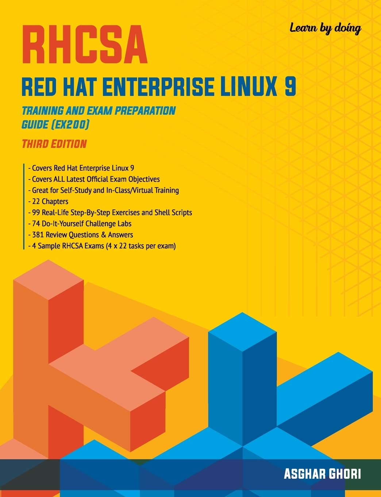

# RHCSA

[Spaced Repetition ](Spaced%20Repetition%2011a3ea4e1c7380289219d41fa7b9060f.md)

[Exam Objectives](Exam%20Objectives%2083748bef3cd543e19f6b3445af101623.md)

[MVP Commands + Notes](MVP%20Commands%20+%20Notes%2011a3ea4e1c7380418a2ecd169208a67c.md)

[3. Basic File Management ](3%20Basic%20File%20Management%203b58b32a7abd4bf2acf80b48d7b45cd4.md)

[4. Adv_File_Management](4%20Adv_File_Management%2076ca18964309449985465991148d2f3f.md)

[5. Basic User Management ](5%20Basic%20User%20Management%201163ea4e1c73805fa47dd7d2bd3d3942.md)

[6. Adv User Management](6%20Adv%20User%20Management%201183ea4e1c7380c48696fc44617250d8.md)

[7. The Bash Shell ](7%20The%20Bash%20Shell%2011f3ea4e1c7380459c07cf0a78541a2d.md)

[8. Linux Processes and Job Scheduling](8%20Linux%20Processes%20and%20Job%20Scheduling%201313ea4e1c7380dc9f75d2fe09c8ba36.md)

[9. Basic Package Management](9%20Basic%20Package%20Management%201363ea4e1c73802e98d5c57eb535515a.md)

[10. Adv Package Management](10%20Adv%20Package%20Management%201363ea4e1c73800d803aebd2346b46ea.md)

[11. Boot Process, GRUB2, and the Linux Kernel](11%20Boot%20Process,%20GRUB2,%20and%20the%20Linux%20Kernel%201553ea4e1c7380278c6bdfbd94fa72d0.md)